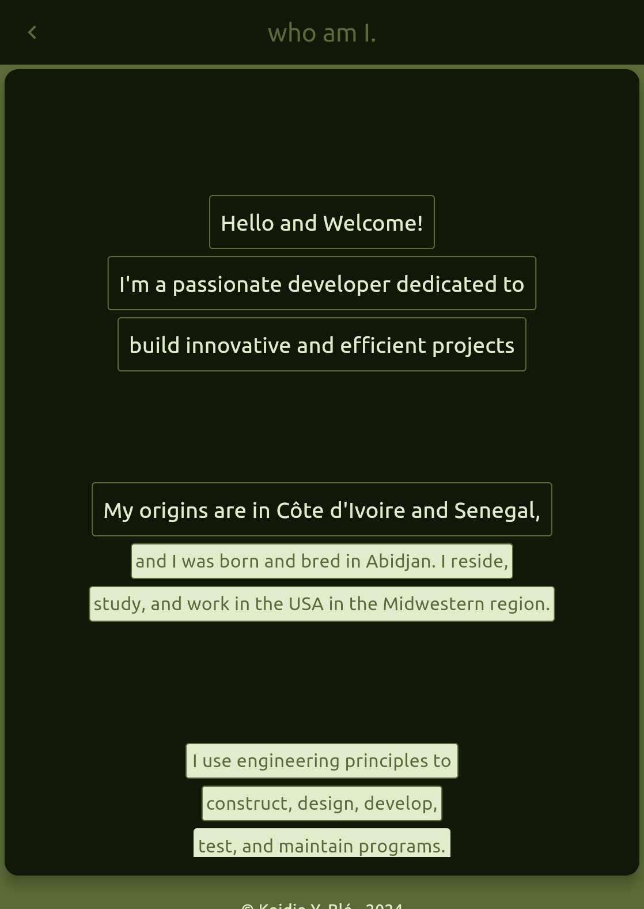

# Blek Flutter Project

A portfolio app showcasing a responsive UI and social media integration.

## Features

- Responsive design for mobile, web, and desktop
- Social media links (GitHub, LinkedIn, Instagram, Gmail)
- Custom widgets for a modern, clean UI

## Setup

1. Clone: `git clone https://github.com/koidioble/blek.git`
2. Install: `flutter pub get`
3. Run: `flutter run`

## Demo

Try the web version: [Blek App](https://koidioble.github.io/blek)

## Screenshots

## Technologies

- Flutter, Dart
- Responsive design with custom widgets

## License

This project is licensed under the MIT License - see the [LICENSE](LICENSE) file for details.
